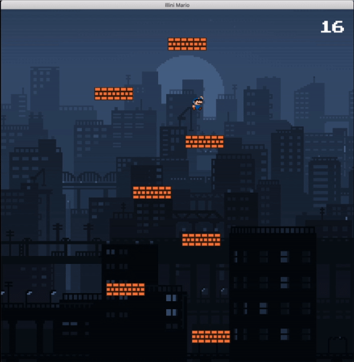

# Illini Mario
Help Illini Mario jump upwards on platforms to safety! View a complete demo [here](https://www.youtube.com/watch?v=-e36jwK-24I).



### Gameplay
Jump upwards and keep up with the falling platforms. Avoid touching the bottom of the screen.

#### Controls
|Key              |Action          |
|-----------------|----------------|
|Enter            |Start           |
|Escape           |Pause           |
|Mouse            |Horizontal Speed|
|Left Mouse Button|Jump            |

### Usage
Instructions to acquire, compile, and run the game.

#### Prerequisites
- [CMake](https://cmake.org)
- [GCC](https://gcc.gnu.org/)
- An IDE ([CLion](https://www.jetbrains.com/clion/) recommended) or text editor

Note: On Windows, you may need to switch your Visual Studio Build Tools version to 2015 to compile the project.

#### Setup
Download the latest version of Cinder for your operating system [here](https://libcinder.org/download).

Create a directory `my-projects` within your Cinder directory  and clone this repository into `my-projects`:

```
cd cinder_0.9.2_mac
mkdir my-projects && cd my-projects
git clone https://github.com/joydeepm02/illini-mario.git
```

#### Running from CLion
If you load the cloned project root directory into an IDE such as CLion, you will be able to access build configurations once the CMake project loads.
You can run the `IlliniMario` configuration to start the game.

#### Building Manually
You can also build the project with the following commands:

```
mkdir cmake-build-debug
cd cmake-build-debug
cmake ..
make
```

After this, you can run the executable (on macOS) as follows:

`./cmake-build-debug/Debug/IlliniMario/IlliniMario.app/Contents/MacOS/IlliniMario`
